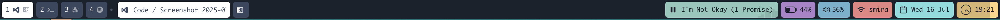
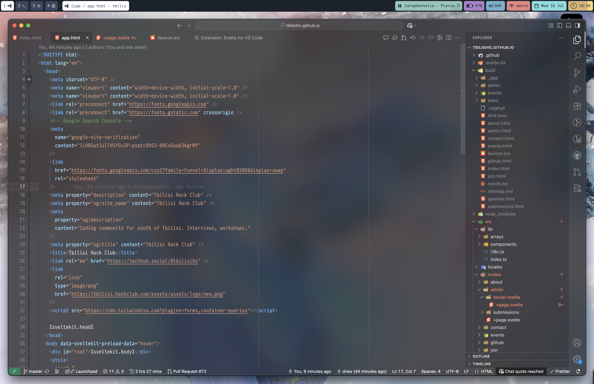

# My Dotfiles

These are my personal dotfiles for configuring my development environment.

---

## Kitty

This is my configuration for the Kitty terminal emulator.

- **Theme**: The active theme is included from `~/github/dotfiles-latest/kitty/active-theme.conf`.
- **Font**: The font is set to `PragmataPro Liga` with a size of 13.
- **Shell**: The default shell is `fish`.
- **Editor**: The default editor is `nvim`.
- **macOS**: The right Option key is configured to act as the Alt key.
- **Cursor**: The cursor is a blinking beam with a trail effect.

---

## Aerospace

This is the configuration for Aerospace, a tiling window manager for macOS.

- **Gaps**: Inner gaps are set to 25 for both horizontal and vertical, and outer gaps are 25 on all sides.
- **Keybindings**:
  - `alt-h/j/k/l` to focus windows.
  - `alt-shift-h/j/k/l` to move windows.
  - `alt-shift-minus/equal` to resize windows.
  - `alt-slash` and `alt-comma` to change layout.
  - `alt-shift-space` to toggle floating for a window.
  - `alt-shift-q` to close a window.
  - `alt-1/2/3/4` to switch workspaces.
  - `alt-shift-1/2/3/4` to move a window to a workspace.
  - `alt-shift-r` to reload the configuration.

---

## simple-bar

I use the default `simple-bar`. You can find it here: [https://github.com/Jean-Tinland/simple-bar](https://github.com/Jean-Tinland/simple-bar)

---

## VSCode

These are my settings for Visual Studio Code.

- **Font**: `PragmataPro Liga` at size 15 with ligatures enabled.
- **Theme**: Based on `Default Dark+` with custom colors.
- **Appearance**:
  - Minimap is disabled.
  - Side Bar is on the right.
  - Breadcrumbs are hidden.
- **Formatting**:
  - Auto-save on focus change is enabled.
  - Format on save is enabled using Prettier.
- **Syntax Highlighting**:
  - Comments and docstrings are italicized.
  - Keywords, storage types, and special variables are italicized.
  - Type names are italic and bold.
  - Function names and calls are italicized.
  - HTML tags and markdown bold are bold.

---

## [Floatplane](https://github.com/andrinoff/floatplane)

There are my settings for Floatplane (Wallpaper manager)

- **Wallpapers**
  - [andrinoff/wallpapers](https://github.com/andrinoff/wallpapers)

